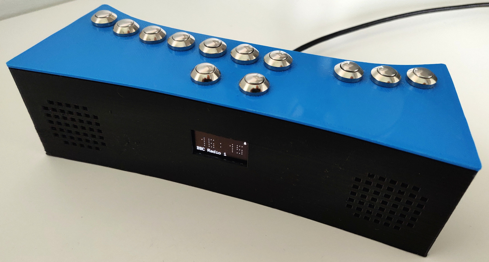
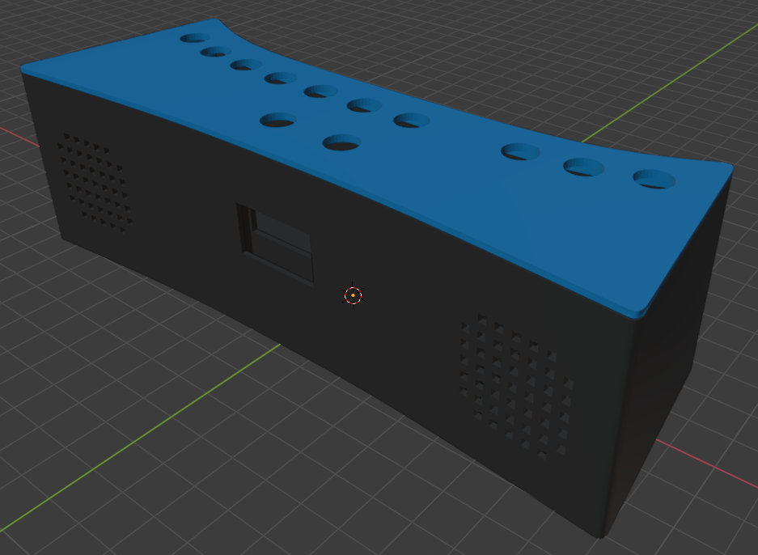

# Vekigi

A 3D printable internet radio based on Golang and a Raspberry Pi Zero WH.

*NB: Vekiĝi means "to wake up" in esperanto.*

## Key features

- Alarm clock with adjustable snooze time (that's a killer feature 😜)
- REST API to easily interface with home automation
- Play
  - webradios (any audio stream playable by [VLC](https://www.videolan.org))
  - local playlists (folders with music files)
  - or remote playlists (through [Mifasol music server](https://github.com/jypelle/mifasol))

Read [the building instructions](doc/building.md) to build your own Vekigi and tune it with [the manual](doc/manual.md).

*Vekigi is a free and open source project distributed under the permissive Apache 2.0 License.*

