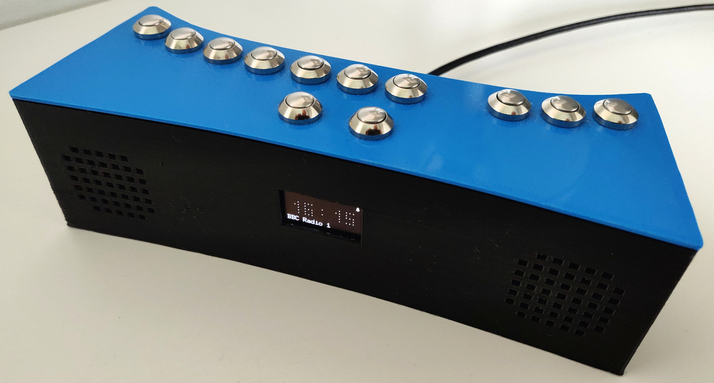
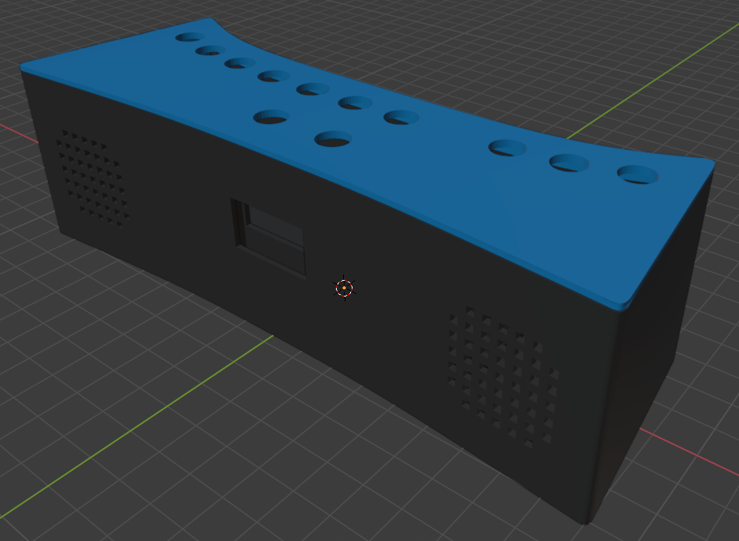

# Vekigi

A 3D printable internet radio based on Golang and a Raspberry Pi Zero WH.

*NB: Vekiĝi means "to wake up" in esperanto.*

## Key features

- Alarm clock with adjustable snooze time (that's a killer feature 😜)
- REST API to easily interface with home automation
- Play
  - webradios (any audio stream playable by [VLC](https://www.videolan.org))
  - local playlists (folders with music files)
  - or remote playlists (through [Mifasol music server](https://github.com/jypelle/mifasol))

Read [the building instructions](doc/building.md) to build your own Vekigi and tune it with [the manual](doc/manual.md).

See [the changelog](CHANGELOG.md) for the release notes.

## Development

Requirements: [Go 1.27+](https://go.dev/dl/) and [Task](https://taskfile.dev).

| Command          | Description                                                                             |
|------------------|-----------------------------------------------------------------------------------------|
| `task build`     | Build the Raspberry Pi Zero binary (ARMv6) into `release/linux-arm/vekigisrv`           |
| `task deploy`    | Build, then deploy and restart the `vekigisrv` service on `pi@vekigi` through SSH       |
| `task simulator` | Run Vekigi on your computer, the OLED display being simulated in a window (debug mode) |

### Simulator

The simulator is only included in binaries built with `-tags simulator`: it displays the OLED screen in a window and simulates the buttons with the keyboard.

| Key                                 | Button           |
|-------------------------------------|------------------|
| `1`-`6` (top row or numpad)         | Digits           |
| `P`                                 | Playlist         |
| `Enter`                             | Alarm setting    |
| `Up` / `Down` (or numpad `+` / `-`) | More / Less      |
| `Space`                             | Snooze           |
| `Right`                             | Next / Power off |

Sound relies on `aplay` and `amixer` (from `alsa-utils`, `aplay` being required to start the server) and on `cvlc` (from [VLC](https://www.videolan.org)) to play webradios and playlists.

## License

Copyright 2021-2026 Jean-Yves Pellé <jy@pelle.link>

Vekigi is a free and open source project distributed under the permissive [Apache 2.0 License](LICENSE).

