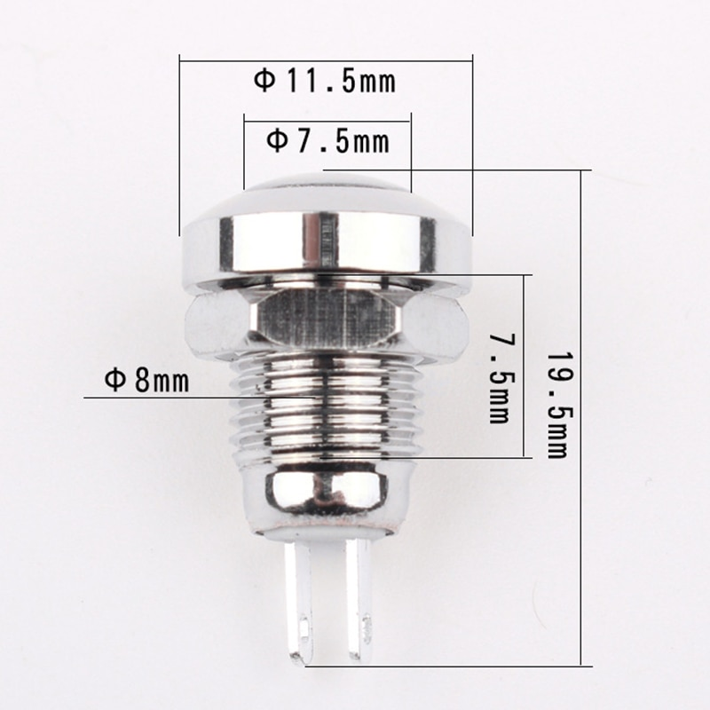
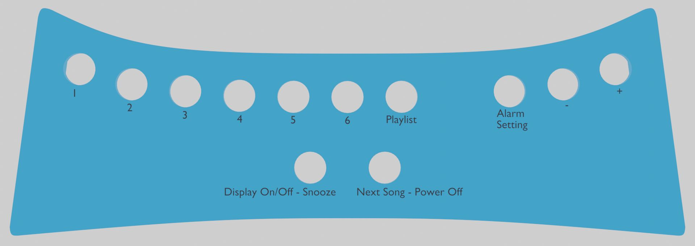
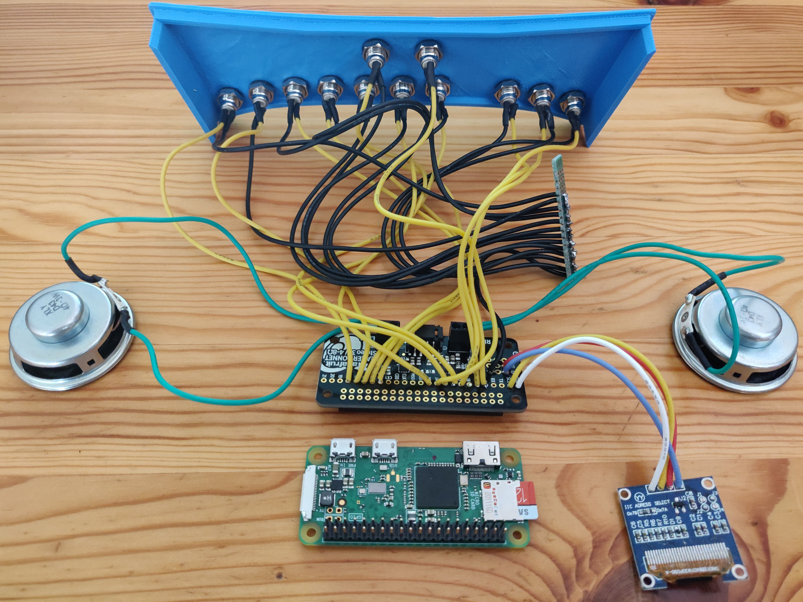
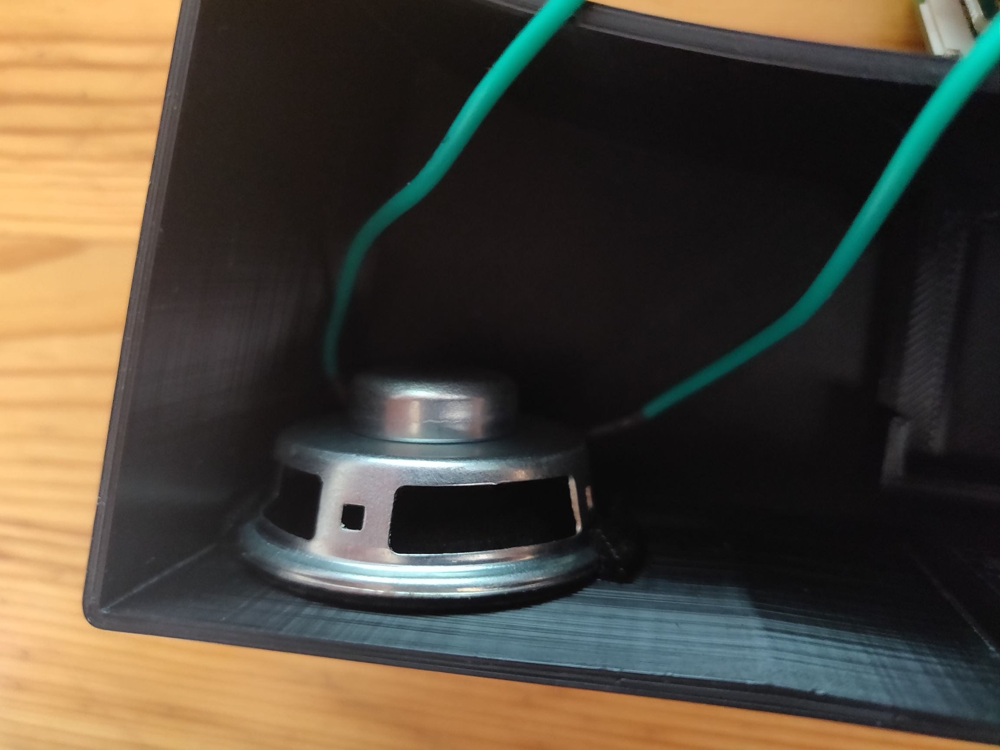
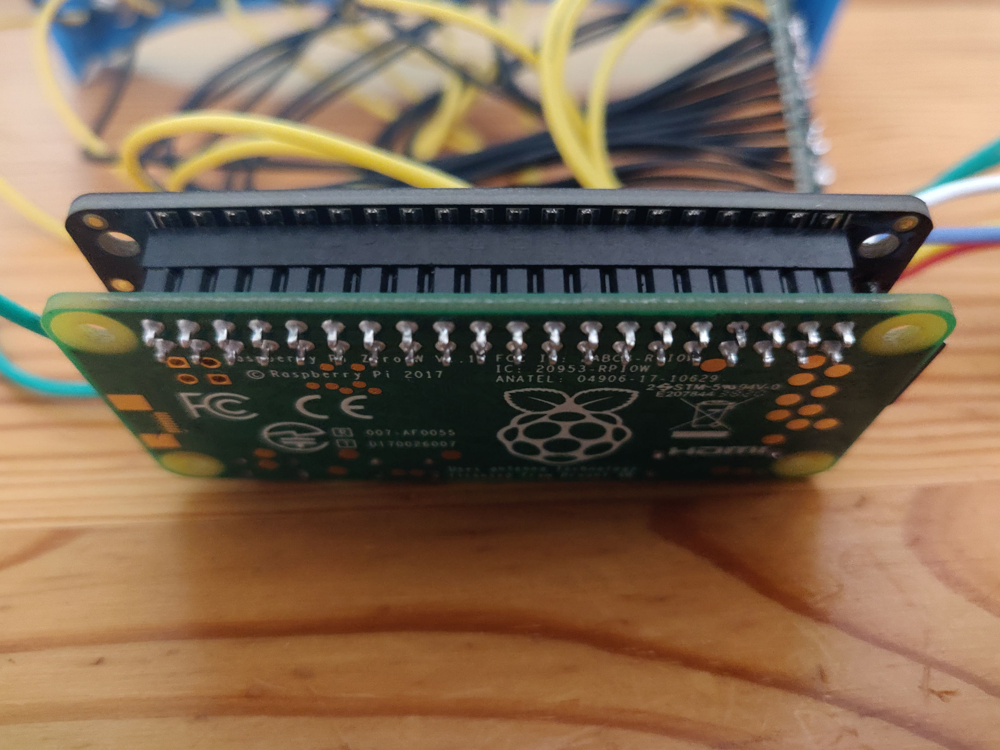
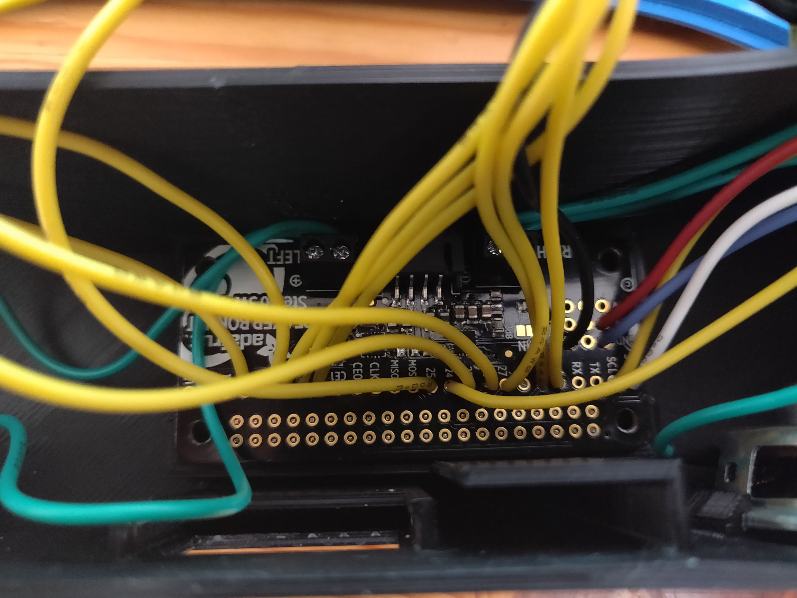
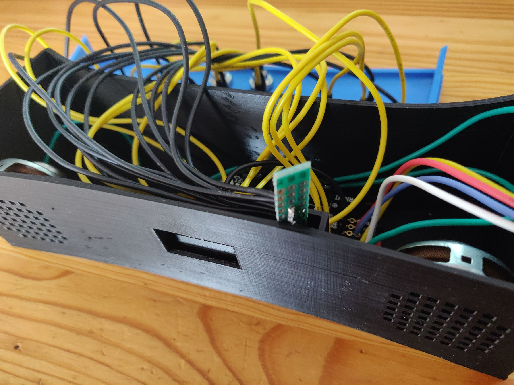
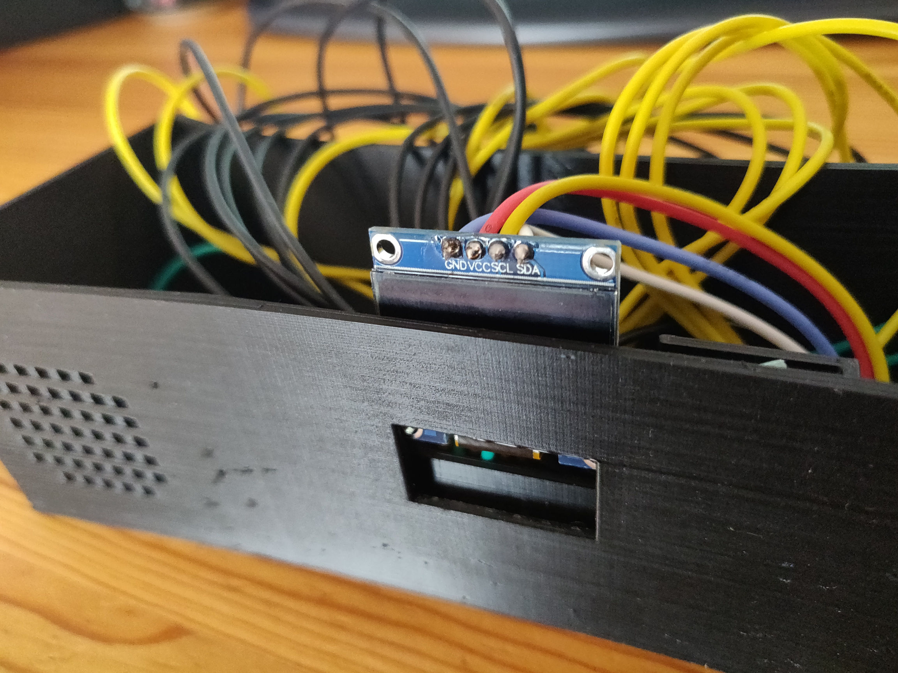

# How to build your *Vekigi*

## Supplies

You will need:

- Raspberry pi zero wh
- [Adafruit I2S 3W stereo speaker bonnet](https://www.adafruit.com/product/3346)
- 5V 2.5A micro-USB power supply
- 32Gb class 10 micro SD card (or more if you want to store local playlists)
- SSD1306 0.96 Inch OLED Display 128x64 I2C   
- 2x Speakers (3W 4 ohms, 4cm diameter)
- 11x [8mm momentary push-button switches](https://fr.aliexpress.com/item/4000043687021.html?spm=a2g0s.9042311.0.0.55246c37O4olh8) 
- Single-sided prototype board (45 x 5 mm)
- [Tinned copper silicone wires 24AWG 0.2mm²](https://www.amazon.fr/gp/product/B07WLNR814)
- Solder wire (0.8mm)
- 3D printer with 1.75mm PLA filament

## Building 

### Printing the components

Print [case.stl](case.stl) and [cover.stl](cover.stl) with those parameters:

- Filament: PLA (one color for the case, another for the cover)
- Resolution: 0.2mm
- Infill: 40%
- Supports: Yes
  
NB: STL files comes from [3dmodel.blend](3dmodel.blend). You can customize them if you want.

### Switches



Attach the 11 switches to the cover.
  
### Soldering



First, there is no soldering to do on the raspberry pi.

All the soldering to be done will be deported to the Adafruit Bonnet:

- For the 11 switches and the Adafruit Bonnet, solder a black wire to connect its ground to the prototype board (which will be used to link them all).

- For each speaker, solder 2 green wires to connect to each bonnet's terminal block (left & right).

- For the OLED display, the link with the bonnet will be done through 4 wires to solder:

  - Ground <-> Ground 
  - 5V <-> 5V  
  - SCL <-> SCL
  - SDA <-> SDA

- For the 11 switches, solder a yellow wire on the remaining pin:

  - "1" switch <-> GPIO 16 pin's bonnet
  - "2" switch <-> GPIO 13
  - "3" switch <-> GPIO 12
  - "4" switch <-> GPIO 6
  - "5" switch <-> GPIO 5
  - "6" switch <-> GPIO 23
  - "PLAYLIST" switch <-> GPIO 22 
  - "ALARM SETTING" switch <-> GPIO 27
  - "-" switch <-> GPIO 17
  - "+" switch <-> GPIO 04
  - "Display On/Off - Snooze" switch <-> GPIO 25 
  - "Next song - Power off" switch <-> GPIO 24

### Assembling

Insert the 2 speakers in their respective slots.



Plug the Adafruit bonnet on the Raspberry Pi.



Insert them at the center of the case.



Slide the prototype board into its dedicated slot.



Do the same with the OLED display.



And voilà !

### Installing

#### Pi zero W

- Download and launch [Raspberry Pi Imager](https://www.raspberrypi.org/software)
- Select *Raspberry Pi OS Lite (32-bit)* image
- Install image to the microSD Card 
- On the sd card `boot` partition:
  - [create](https://www.raspberrypi.org/documentation/configuration/wireless/headless.md) `wpa_supplicant.conf` with your wifi crendentials
  - create a blank file named `ssh`
- Insert the sd card into the Pi, and start it
- Wait 5 minutes
- Use your router to find Pi's IP address.
- Execute `sudo nano /etc/hosts` from a computer connected to the same lan to add vekigi's IP :
  ```
  XX.XX.XX.XX vekigi
  ```
- Connect to the PI through SSH: `ssh pi@vekigi` with password `raspberry`
- Set new Pi's password
- Execute `sudo apt update` && `sudo apt upgrade`
- Execute `sudo raspi-config`
  - Replace `raspberrypi` hostname with `vekigi` (or `vekigi2` to avoid conflicts with another vekigi)
  - Set your Timezone
  - Enable I2C
- Execute `sudo nano /etc/asound.conf` to enable speakers:

```
pcm.speakerbonnet {
   type hw card 0
}

pcm.dmixer {
   type dmix
   ipc_key 1024
   ipc_perm 0666
   slave {
     pcm "speakerbonnet"
     period_time 0
     period_size 1024
     buffer_size 8192
     rate 44100
     channels 2
   }
}

ctl.dmixer {
    type hw card 0
}

pcm.softvol {
    type softvol
    slave.pcm "dmixer"
    control.name "PCM"
    control.card 0
}

ctl.softvol {
    type hw card 0
}

pcm.!default {
    type             plug
    slave.pcm       "softvol"
}
```

- Execute `sudo nano /boot/config.txt`:

```
#dtparam=audio=on
dtoverlay=hifiberry-dac
dtoverlay=i2s-mmap
```

- Restart the Pi with `sudo reboot`

- Reconnect to the PI through SSH: `ssh pi@vekigi`

#### VLC

```bash
sudo apt install vlc
```

#### Vekigi server binary

#### Add service to auto start and stop vekigi server

- Create systemd service file

    ```
    sudo touch /etc/systemd/system/vekigisrv.service
    sudo chmod 664 /etc/systemd/system/vekigisrv.service
    ```

- Edit /etc/systemd/system/vekigisrv.service

    ```
    [Unit]
    Description=Vekigi server
    
    [Service]
    Type=simple
    Restart=on-failure
    ExecStart=/home/pi/vekigisrv run
    User=pi
    Group=pi
    
    [Install]
    WantedBy=multi-user.target
    ```

- Enable & start vekigi server

    ```
    sudo systemctl daemon-reload
    sudo systemctl enable vekigisrv.service
    ```

##### Install

###### From source

- Execute `make install` from a computer connected to the same lan
- Wait a few minutes to see the time displayed on your *Vekigi*

###### From prebuilt binary

- Copy `vekigisrv` binary to `/home/pi/vekigisrv`
- Execute `chmod a+x /home/pi/vekigisrv`
- Start vekigi server with `sudo systemctl start vekigisrv.service`
- Wait a few minutes to see the time displayed on your *Vekigi*
